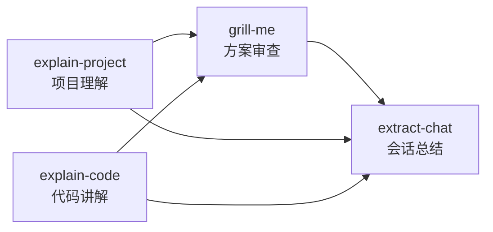

# Yo-Analy 技能索引

Yo-Analy 是多个分析辅助技能的集合入口。根据你的需求，自动路由到最合适的子技能。

## 可用子技能

**可以使用 /yo-analy help 列出下面所有子技能**

| 子技能 | 路径 | 用途 | 典型触发语 |
|--------|------|------|-----------|
| **explain-code** | `reference/explain-code/` | 用可视化图表和类比详细解释代码 | "这段代码怎么工作的？"、"解释一下这个函数" |
| **explain-project** | `reference/explain-project/` | 分析代码库并生成项目文档（AGENTS.md、rules、skills） | "分析这个项目"、"生成项目文档"、"新人怎么上手" |
| **grill-me** | `reference/grill-me/` | 对方案或设计反复追问，逐条厘清决策树直至达成共识 | "严格审查我"、"压力测试方案"、"帮我挑设计毛病" |
| **extract-chat** | `reference/extract-chat/` | 将当前对话精简为方案/设计文档，供下一位 agent 接手 | "总结这次对话"、"总结对话给下个 agent 用" |
| **tell-story** | `reference/tell-story/` | 用寓言故事的方式间接讲解概念，延迟揭示+逐一对照解释 | "用故事讲XX"、"帮我理解XX"、"怎么通俗解释XX" |

**理解与文档**：
- **explain-project** → 新人上手、生成 AI 协作文档
- **explain-code** → 理解具体代码逻辑
- **tell-story** → 以寓言故事方式理解抽象概念（轻松学习场景）

**方案与设计**：
- **grill-me** → 设计审查、压力测试、消除方案歧义（逐一提问，可结合代码库查证）
- **extract-chat** → 会话结束时的对话沉淀（输出到 `docs/yo-analy/`，引用已有 PRD/计划等，不重复）

## 技能工作流

分析类任务中，子技能可按以下方式衔接（非强制，按需选用）：

**入口选择提示：**
- 需要理解仓库或生成协作文档 → **explain-project**
- 需要理解某段具体代码 → **explain-code**
- 已有方案/设计，需要被严格追问、逐条拍板 → **grill-me**
- 长对话告一段落，需要给下一位 agent 可接续的文档 → **extract-chat**

## 路由规则

### 1. 显式指定（优先）

如果用户输入包含 `/yo-analy <子技能名>`，直接加载对应子技能：

- `/yo-analy explain-code ...` → 加载 `reference/explain-code/SKILL.md`
- `/yo-analy explain-project ...` → 加载 `reference/explain-project/SKILL.md`
- `/yo-analy grill-me ...` → 加载 `reference/grill-me/SKILL.md`
- `/yo-analy extract-chat ...` → 加载 `reference/extract-chat/SKILL.md`
- `/yo-analy tell-story ...` → 加载 `reference/tell-story/SKILL.md`

将 `/yo-analy <子技能名>` 之后的剩余内容作为任务传递。

### 2. 自动推断

如果用户只输入 `/yo-analy` 或 `/yo-analy <问题>` 但没有指定子技能名，根据用户意图推断：

| 用户意图关键词 | 匹配子技能 |
|--------------|-----------|
| 解释代码、代码讲解、这段代码、这个函数、怎么工作的、原理是什么 | **explain-code** |
| 分析项目、项目文档、AGENTS.md、rules、skills、新人上手、项目结构 | **explain-project** |
| 生成文档、文档化、项目解析 | **explain-project** |
| 严格审查、压力测试、挑毛病、反复问、达成共识、设计审查、grill | **grill-me** |
| 总结对话文档、对话提炼给下个 agent、会话沉淀、extract、chat 文档 | **extract-chat** |
| 保存方案、设计文档给后续、docs/yo-analy | **extract-chat** |
| 用故事讲、帮我理解、通俗解释、原理是什么、怎么理解、讲个故事 | **tell-story** |
| 概念学习、设计模式讲解、技术原理故事化 | **tell-story** |

**推断步骤：**
1. 分析用户问题的核心意图
2. 对照上表匹配最合适的子技能
3. 告知用户将使用哪个子技能，然后加载执行

### 3. 歧义处理

当用户意图同时涉及多个子技能（如"分析项目并解释核心代码"）：
1. 向用户说明各子技能的分工
2. 询问用户希望先执行哪个，或建议执行顺序
3. 按用户选择依次调用

常见组合建议：
- "分析项目并严格审查方案" → 先 **explain-project**，再 **grill-me**
- "讲完代码后总结给下个 agent" → 先 **explain-code**，再 **extract-chat**
- "设计审查对话完要总结" → 先 **grill-me**，再 **extract-chat**
- "理解项目后写总结文档给agent" → 先 **explain-project**，再 **extract-chat**
- "讲个故事帮我理解这个设计模式" → **tell-story**
- "理解概念后深入代码实现" → 先 **tell-story**，再 **explain-code**

**grill-me 与 explain-code / explain-project 歧义时：** 用户要被动理解现有代码或项目 → **explain-code** / **explain-project**；用户要主动被追问、拍板方案 → **grill-me**。

**extract-chat 与 explain-project 歧义时：** 用户要生成面向仓库的长期协作文档（AGENTS.md 等）→ **explain-project**；用户要沉淀当前会话、供下一位 agent 接续 → **extract-chat**。

## 工作流程

1. **解析用户输入**：检查是否包含 `/yo-analy <子技能名>` 的显式指定
2. **匹配子技能**：
   - 显式指定 → 直接使用对应子技能
   - 未指定 → 根据意图关键词自动推断
3. **加载并执行**：读取对应子技能的 SKILL.md，按其子技能的指令完成任务
4. **结果汇总**：将子技能的执行结果返回给用户

## 注意事项

- 本技能本身不执行具体任务，只负责路由到正确的子技能
- 子技能在 `reference/` 目录下
- 子技能的详细工作流程和规则，请参考各自的 SKILL.md
- **grill-me** 须逐一提问，不得一次抛出所有问题；能通过查看代码库解答的问题应直接查证
- **extract-chat** 输出路径为 `docs/yo-analy/YYYY-MM-DD-<topic>-chat.md`，须含「建议技能」章节，引用已有 PRD/计划等而非重复，并剔除 API 密钥等敏感信息
- **extract-chat** 若用户传入参数，视为对下次会话重点的说明，据此调整文档侧重点
