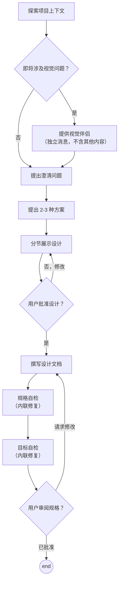

# 将想法头脑风暴为设计

帮助通过自然的协作对话将想法转化为完整的设计和规格说明。

首先了解当前项目上下文，然后一次一个问题来细化想法。一旦理解了要构建的内容，就展示设计并获得用户批准。

<HARD-GATE>
在展示设计并获得用户批准之前，不要调用任何实施技能、编写任何代码、搭建任何项目或采取任何实施行动。这适用于**每一个**项目，无论其看起来多么简单。
</HARD-GATE>

## 反模式："这个太简单了，不需要设计"

每个项目都要经过这个过程。一个待办事项列表、一个单功能工具、一个配置更改——所有这些都要。"简单"的项目正是那些未经审视的假设导致最多浪费工作的地方。设计可以很短（真正简单的项目只需几句话），但你**必须**展示它并获得批准。

## 检查清单

你必须为以下每个项目创建一个任务并按顺序完成它们：

1. **探索项目上下文** — 检查文件、文档、最近的提交
2. **提供视觉伴侣**（如果话题涉及视觉问题）— 这是独立的一条消息，不与澄清问题合并。详见下面的「视觉伴侣」部分。
3. **提出澄清问题** — 一次一个，理解目的/约束/成功标准
4. **提出 2-3 种方案** — 附带权衡分析和你推荐的方案
5. **展示设计** — 按复杂度分节展示，每节之后获得用户确认
6. **撰写设计文档** — 保存到 `docs/yo/specs/YYYY-MM-DD-<topic>-design.md` 并提交
7. **规格自检** — 快速内联检查占位符、矛盾、歧义、范围（见下文）
8. **目标自检** — 详细检查当前的设计文档，是否满足用户意图和需求，是否存在设计遗漏和设计问题，修复和完善设计文档
9. **用户审阅书面规格** — 请用户在继续之前审阅规格文件

## 流程图

**终止状态是直接结束** 不要调用或执行任何其他实施技能。

## 过程

**理解想法：**

- 首先查看当前项目状态（文件、文档、最近提交）
- 在问详细问题之前，先评估范围：如果请求描述了多个独立的子系统（例如，"构建一个包含聊天、文件存储、计费和分析的平台"），立即标记出来。不要在一个需要分解的项目上花费问题去细化细节。
- 如果项目对于单个规格来说太大，帮助用户将其分解为子项目：哪些是独立的模块，它们如何关联，应该按什么顺序构建？然后通过正常的设计流程对第一个子项目进行头脑风暴。每个子项目都有自己的规格 → 计划 → 实施周期。
- 对于规模合适的项目，一次一个问题来细化想法
- 尽可能使用选择题，但开放式问题也可以
- 每条消息只问一个问题 —— 如果一个话题需要更多探索，将其拆分为多个问题
- 聚焦于理解：目的、约束、成功标准

**探索方案：**

- 提出 2-3 种不同的方案，附带权衡分析
- 以对话方式展示选项，给出你的推荐和理由
- 先给出你的推荐选项并解释原因

**展示设计：**

- 一旦你认为理解了要构建的内容，就展示设计
- 根据每节的复杂度调整篇幅：简单的几句话，复杂的 200-300 字
- 每节展示后询问到目前为止是否看起来正确
- 涵盖：架构、组件、数据流、错误处理、测试
- 如果有不清楚的地方，准备好，再返回去澄清

**为隔离性和清晰度而设计：**

- 将系统拆分为更小的单元，每个单元有一个明确的目的，通过定义良好的接口通信，并且可以独立理解和测试
- 对于每个单元，你应该能够回答：它是做什么的，如何使用它，它依赖于什么？
- 有人能在不阅读内部实现的情况下理解一个单元的功能吗？你能在不破坏使用者的情况下改变内部实现吗？如果不能，边界需要调整。
- 更小、边界清晰的单元也更容易处理 —— 你能一次在上下文中理解的代码，你推理得更好，而且当文件聚焦时你的编辑更可靠。当一个文件变得很大时，这通常是它做了太多事情的信号。

**在现有代码库中工作：**

- 在提出更改之前先探索现有结构。遵循现有模式。
- 如果现有代码存在问题影响工作（例如，文件变得太大、边界不清晰、职责纠缠），将针对性的改进作为设计的一部分 —— 就像一个优秀的开发人员在工作的代码中改进它一样。
- 不要提议无关的重构。专注于服务于当前目标的内容。

## 设计之后

**文档：**

- 设计文档：风格要素，清晰简洁的写作
- 将验证过的设计（规格）写入 `docs/yo/specs/YYYY-MM-DD-<topic>-design.md`
  - （用户对规格位置的偏好优先于此默认路径）

**规格自检：**
撰写规格文档后，用 fresh eyes 审视它：

1. **占位符扫描：** 有 "TBD"、"TODO"、不完整的章节或模糊的需求吗？修复它们。
2. **内部一致性：** 各章节之间有矛盾吗？架构是否与功能描述匹配？
3. **范围检查：** 这足够聚焦用于单个实施计划，还是需要分解？
4. **歧义检查：** 任何需求是否可能被两种不同方式理解？如果是，选择一种并明确说明。

内联修复任何问题。不需要重新审阅 —— 直接修复然后继续。

**目标自检：**
撰写规格文档后，用 fresh eyes 审视它：

1、详细检查当前的设计文档，是否满足用户意图和需求。
2、是否存在设计遗漏和设计问题
3、完善设计文档

内联修复任何问题。不需要重新审阅 —— 直接修复然后继续。

**用户审阅关卡：**
规格审阅循环通过后，请用户在继续之前审阅书面规格：

> "规格已撰写并提交到 `<path>`。请在开始撰写实施计划之前审阅它，如果有任何想修改的地方请告诉我。"

等待用户的回复。如果他们请求修改，进行修改并重新运行规格审阅循环。只有在用户批准后才能继续。

**结束：**

- 不要调用任何其他技能。结束当前。
- 可以提示用户：可以调用 `/yo-analy grill-me` 进行深入细致的询问探讨，直至我们达成共识

## 核心原则

- **一次一个问题** —— 不要一次性问太多问题
- **优先选择题** —— 可能的情况下，比开放式问题更容易回答
- **严格遵循 YAGNI** —— 从所有设计中移除不必要的功能
- **探索替代方案** —— 在确定之前总是提出 2-3 种方案
- **增量验证** —— 展示设计，在继续之前获得批准
- **保持灵活** —— 当某些内容不清楚时，返回去澄清

## 视觉伴侣

一个基于浏览器的伴侣工具，用于在头脑风暴期间展示原型、图表和视觉选项。作为工具提供 —— 不是模式。接受伴侣意味着它可用于受益于视觉处理的问题；并不意味着每个问题都通过浏览器。

**提供伴侣：** 当你预计即将出现的问题会涉及视觉内容（原型、布局、图表）时，一次性征求同意：
> "我们讨论的一些内容如果能在网页浏览器中展示给你可能会更容易理解。我可以在过程中整理原型、图表、对比图和其他视觉内容。可能会消耗较多 token。想试试吗？（需要打开本地 html）"

**这个提议必须是独立的消息。** 不要将其与澄清问题、上下文摘要或任何其他内容合并。消息应该只包含上面的提议，没有其他内容。等待用户的回复后再继续。如果他们拒绝，仅使用文本进行头脑风暴。

**每个问题单独决定：** 即使用户接受了，对每个问题都要**单独决定**是否使用浏览器或终端。判断标准：**用户通过看到它是否比阅读它理解得更好？**

- **使用浏览器** 用于内容是视觉的 —— 原型、线框图、布局对比、架构图、并排的视觉设计
- **使用终端** 用于内容是文本的 —— 需求问题、概念选择、权衡列表、A/B/C/D 文本选项、范围决策

一个关于 UI 话题的问题不一定是视觉问题。"在这种情况下个性意味着什么？" 是概念问题 —— 使用终端。"哪个向导布局更好？" 是视觉问题 —— 使用浏览器。

如果他们同意使用伴侣，在继续之前阅读详细指南：`./visual-companion.md`
