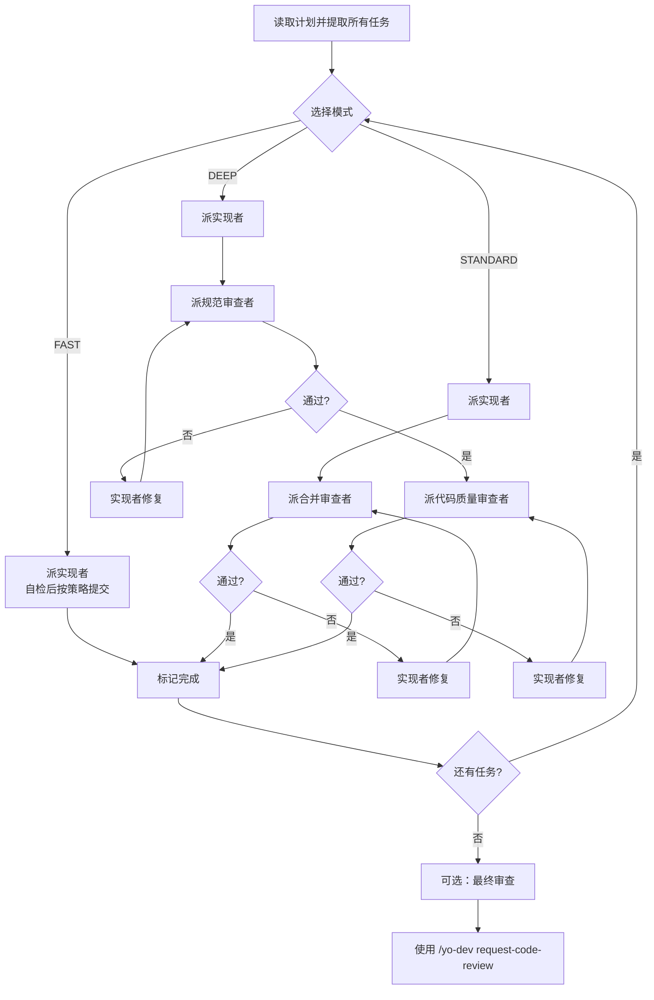

# 子代理驱动开发

在当前会话内，把实现计划拆分为独立任务，为每个任务分派**全新上下文**的子代理执行，并按任务复杂度选择审查深度。

## 核心原则

- 每个任务用全新子代理，不继承主会话上下文
- 控制器预先提取所有任务和上下文，避免子代理重复读计划文件
- 按复杂度选择流程深度，避免小题大做

## 何时使用

- 已有实现计划
- 任务相对独立，可在同一会话内执行
- 需要子代理专注实现，控制器保留协调上下文

## 启动前配置

**提交策略（启动时确定，贯穿全程）：**

- **每任务提交（默认，除非用户要求不commit）**：任务完成后执行 `git commit`。
- **Review-First**：任务完成后**不提交**，只生成变更摘要和关键 diff，等待用户 review。

## 流程深度

按任务特征选择模式。默认使用 **STANDARD**。

| 模式 | 适用场景 | 流程 | 最少子代理调用 |
|---|---|---|---|
| **FAST** | 单文件/机械修改、文档/配置、低风险、无行为变更 | 实现者自检 → 完成 | 1 |
| **STANDARD** | 常规功能/修复、2-5 个文件、有明确验收标准 | 实现者 → 合并审查者 → 修复（如需） | 2 |
| **DEEP** | 架构改动、跨模块协调、高风险、容易过度/不足构建 | 实现者 → 规范审查者 → 修复 → 代码质量审查者 → 修复 | 3+ |

> 不确定时，先读 `./triage-guide.md` 快速判定。

## 执行流程

## 模型选择

为每个角色使用能够胜任的最低能力模型：

- **实现者**：机械任务用快速模型；集成/判断任务用标准模型
- **审查者**：常规审查用标准模型；高风险/架构审查用最强模型

## 处理实现者状态

- **DONE**：继续审查或标记完成。
- **DONE_WITH_CONCERNS**：阅读疑虑。涉及正确性/范围则先解决；观察意见则记录后继续。
- **NEEDS_CONTEXT**：提供缺失上下文并重新分派。
- **BLOCKED**：按以下顺序处理：
  1. 补充上下文，用相同模型重试
  2. 换更强能力模型
  3. 拆分任务
  4. 计划本身有误则上报人类

## 提示模板

- `./implementer-prompt.md` - 实现者
- `./merged-reviewer-prompt.md` - STANDARD 合并审查者
- `./spec-reviewer-prompt.md` - DEEP 规范审查者
- `./code-quality-reviewer-prompt.md` - DEEP 代码质量审查者
- `./triage-guide.md` - 模式选择参考

## 危险信号

**永远不要：**
- 未经用户明确同意就在 main/master 分支上开始实现
- 跳过审查（规范合规性或代码质量）
- 带着未修复的问题继续
- 并行分派多个实现子代理（冲突）
- 让子代理读取计划文件（改为提供完整文本）
- 跳过场景设置上下文（子代理需要理解任务所在位置）
- 忽视子代理的问题（在让他们继续之前回答）
- 在规范合规性上接受"差不多就行"（规范审查者发现问题 = 未完成）
- 跳过审查循环（审查者发现问题 = 实现者修复 = 再次审查）
- 让实现者自检替代实际审查（两者都需要）
- **在规范合规性通过 ✅ 之前开始代码质量审查**（顺序错误）
- 在任一审查存在未解决问题时转到下一个任务
- 用户已选择 Review-First 模式时，不要擅自替用户提交

**如果子代理提问：**
- 清晰完整地回答
- 如需要，提供额外上下文
- 不要催促他们立即开始实现

**如果审查者发现问题：**
- 实现者（同一子代理）修复
- 审查者再次审查
- 重复直到批准
- 不要跳过重新审查

**如果子代理任务失败：**
- 用具体指令分派修复子代理
- 不要手动尝试修复（上下文污染）
