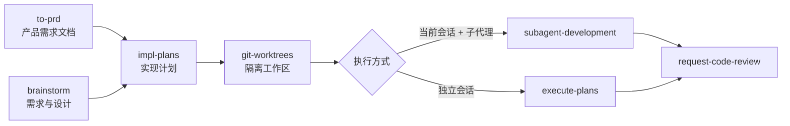

# Yo 技能索引

Yo 是多个开发辅助技能的集合入口。根据你的需求，自动路由到最合适的子技能。

## 可用子技能

**可以使用 /yo help 列出下面所有子技能**

| 子技能 | 路径 | 用途 | 典型触发语 |
|--------|------|------|-----------|
| **to-prd** | `reference/to-prd/` | 生成结构化产品需求文档（PRD），含用户故事、验收标准与技术规范 | "写 PRD"、"记录需求"、"规划功能"、"产品需求文档" |
| **brainstorm** | `reference/brainstorm/` | 创造性工作前的需求探索与设计，产出规格文档 | "帮我设计这个功能"、"头脑风暴一下"、"新功能怎么做" |
| **impl-plans** | `reference/impl-plans/` | 根据规范撰写细粒度实现计划 | "写实现计划"、"怎么实现这个功能"、"制定开发计划" |
| **git-worktrees** | `reference/git-worktrees/` | 创建隔离工作区，避免污染当前分支 | "开独立分支开发"、"设置 worktree"、"隔离工作区" |
| **subagent-development** | `reference/subagent-development/` | 在当前会话用子代理逐任务执行计划 | "用子代理执行计划"、"在当前会话实施" |
| **execute-plans** | `reference/execute-plans/` | 在独立会话中执行书面计划 | "执行这个计划"、"按计划实施"、"docs/yo/plans/..." |
| **request-code-review** | `reference/request-code-review/` | 派遣审查子代理，验证工作是否符合要求 | "代码审查"、"review 一下"、"合并前检查" |
| **frontend-code-review** | `reference/frontend-code-review/` | 前端代码审查，检查 React/Vue 规范、交互标准、功能与性能问题 | "前端代码审查"、"review 前端代码"、"检查前端规范" |

## 技能工作流

典型开发流程中，子技能可按以下顺序衔接（非强制，按需选用）：

**入口选择提示：**
- 需要正式 PRD（KPI、用户故事、验收标准、AI 系统需求）→ **to-prd**
- 需要交互式方案探索、可视化对比、设计稿确认 → **brainstorm**
- 可先 **brainstorm** 再 **to-prd** 将结论固化为 PRD，也可直接使用 **to-prd**（其自带探索访谈阶段）

## 路由规则

### 1. 显式指定（优先）

如果用户输入包含 `/yo <子技能名>`，直接加载对应子技能：

- `/yo to-prd ...` → 加载 `reference/to-prd/SKILL.md`
- `/yo brainstorm ...` → 加载 `reference/brainstorm/SKILL.md`
- `/yo impl-plans ...` → 加载 `reference/impl-plans/SKILL.md`
- `/yo git-worktrees ...` → 加载 `reference/git-worktrees/SKILL.md`
- `/yo subagent-development ...` → 加载 `reference/subagent-development/SKILL.md`
- `/yo execute-plans ...` → 加载 `reference/execute-plans/SKILL.md`
- `/yo request-code-review ...` → 加载 `reference/request-code-review/SKILL.md`
- `/yo frontend-code-review ...` → 加载 `reference/frontend-code-review/SKILL.md`

将 `/yo <子技能名>` 之后的剩余内容作为任务传递。

### 2. 自动推断

如果用户只输入 `/yo` 或 `/yo <问题>` 但没有指定子技能名，根据用户意图推断：

| 用户意图关键词 | 匹配子技能 |
|--------------|-----------|
| PRD、产品需求文档、需求文档、用户故事、验收标准、记录需求、规划功能、成功指标、非目标 | **to-prd** |
| 设计、头脑风暴、新功能、怎么做、方案对比、需求探索、规格说明 | **brainstorm** |
| 实现计划、开发计划、怎么实现、任务拆解、实施步骤 | **impl-plans** |
| worktree、隔离工作区、独立分支、开新分支开发 | **git-worktrees** |
| 子代理执行、当前会话实施、subagent | **subagent-development** |
| 执行计划、按计划实施、实施 docs/yo/plans | **execute-plans** |
| 代码审查、review、合并前检查、审查改动 | **request-code-review** |
| 前端代码审查、前端 review、检查前端规范、React/Vue 代码审查、交互标准检查 | **frontend-code-review** |

**推断步骤：**
1. 分析用户问题的核心意图
2. 对照上表匹配最合适的子技能
3. 告知用户将使用哪个子技能，然后加载执行

**执行方式选择提示：** 当用户要"执行计划"但未说明方式时，优先询问：
- 当前会话 + 子代理可用 → 建议 **subagent-development**
- 需要独立会话或并行开发 → 建议 **execute-plans** + **git-worktrees**

### 3. 歧义处理

当用户意图同时涉及多个子技能：
1. 向用户说明各子技能的分工
2. 询问用户希望先执行哪个，或建议执行顺序
3. 按用户选择依次调用

常见组合建议：
- "写 PRD 并实现" → 先 **to-prd**，再 **impl-plans**，再选择 **subagent-development** 或 **execute-plans**
- "设计并实现某功能" → 先 **brainstorm**，再 **impl-plans**，再选择 **subagent-development** 或 **execute-plans**
- "先头脑风暴再写 PRD" → **brainstorm** → **to-prd** → **impl-plans**
- "做完功能准备合并" → **request-code-review**

**to-prd 与 brainstorm 歧义时：** 用户要可交付的正式需求文档 → **to-prd**；用户要开放式方案讨论与设计确认 → **brainstorm**。

## 工作流程

1. **解析用户输入**：检查是否包含 `/yo <子技能名>` 的显式指定
2. **匹配子技能**：
   - 显式指定 → 直接使用对应子技能
   - 未指定 → 根据意图关键词自动推断
3. **加载并执行**：读取对应子技能的 SKILL.md，按其子技能的指令完成任务
4. **结果汇总**：将子技能的执行结果返回给用户

## 注意事项

- 本技能本身不执行具体任务，只负责路由到正确的子技能
- 子技能在 `reference/` 目录下
- 子技能的详细工作流程和规则，请参考各自的 SKILL.md
- **to-prd** 有探索门槛：编写 PRD 前须至少提出两个澄清问题，不得跳过访谈阶段；输出须遵循子技能中的 PRD 章节结构（执行摘要、用户体验、AI 需求、技术规范、风险路线图）
- **brainstorm** 有 HARD-GATE：展示设计并获得用户批准前，不得编写代码或调用实施技能
- **to-prd** 与 **brainstorm** 均偏需求阶段：前者产出正式 PRD，后者侧重交互式设计与规格探索；二者可串联，勿与 **impl-plans** 混淆（实现计划面向开发任务拆解）
- **execute-plans** 与 **subagent-development** 功能重叠：前者适合独立会话，后者适合当前会话 + 子代理平台
- **request-code-review** 常在 **subagent-development** 或 **execute-plans** 完成后自动衔接调用
